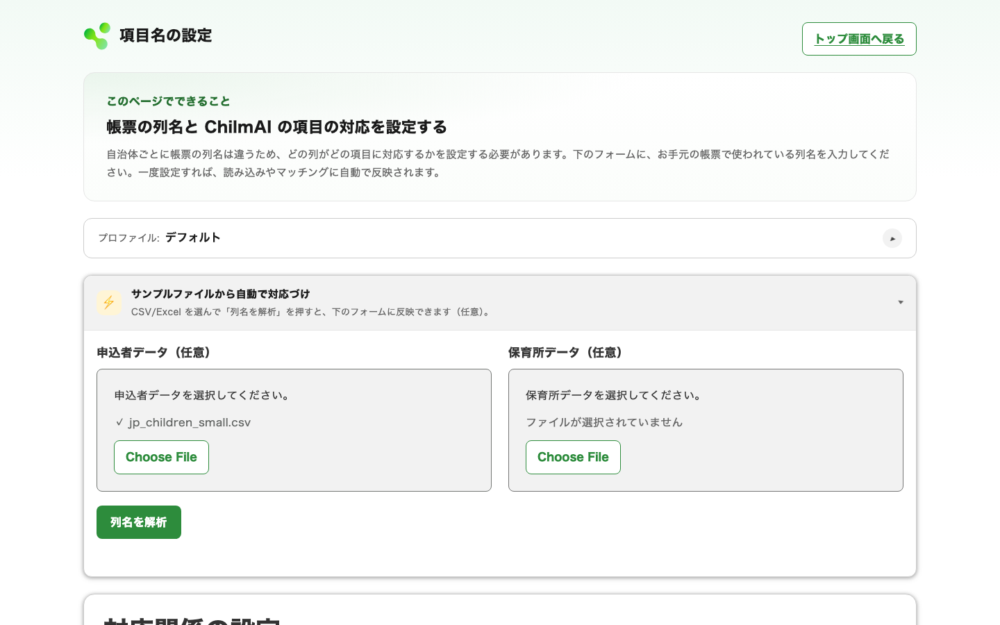
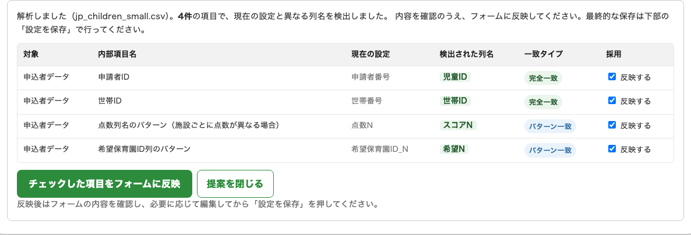

# 自分のデータで使う

このページでは、自治体の帳票データを ChilmAI で使えるようにする準備を説明します。準備は次の 2 つの作業に分かれます。初めて設定するときは、まず A でデータを整形して最終的な列名を決め、その列名を B で登録する順に進めてください。

| 作業 | 内容 | 頻度 |
|---|---|---|
| [A. 入力データの整形](#data-recipes) | 申込者データを ChilmAI が読める形に整える（Excel での作業） | 選考の都度 |
| [B. 項目名の設定](#column-mapping) | 帳票の列名を ChilmAI の画面で登録する（画面での操作） | 初回のみ（帳票の列名が変わったら見直し） |

所要時間は帳票の形式によりますが、初回は数時間程度を見込んでください。2 回目以降は A の作業だけになり、大きく短縮されます。

## 必要な列を確認する {#required-columns}

最初に、次の列に対応するデータがそろっているかを確認してください。**列名は自治体の帳票のままで構いません**（[項目名の設定](#column-mapping) で対応づけます）。ここに挙げる列名は例です。

!!! note "「施設」と「保育所」は同じ意味です"
    本ガイドでは「施設」と「保育所」を同じ意味で使っています（例：「希望施設コード」は希望する保育所の ID を並べた列です）。

**申込者データ**（1 行 ＝ 1 申請児童）

| 列（例） | 内容 |
|---|---|
| `申請者番号` | 児童を一意に識別する ID |
| `世帯番号` | 同一世帯（きょうだい）を識別する ID。同じ値の行が同一世帯（きょうだい）として扱われます |
| `年齢` | 基準日時点の年齢（0〜5 の整数） |
| `点数` | 入所優先度の基準となる値（整数・大きいほど優先）。保育所（希望順位）ごとに点数が異なる場合は、希望順位に対応した `点数1`〜`点数N` の複数列になります |
| `タイブレーク1`〜`タイブレークN` | 点数が同点の場合に優先順位を決める列。[点数と合わせて整えます](#score) |
| `希望1施設コード` 〜 `希望N施設コード` | 希望する保育所の ID（希望順）。列数に上限はありません |
| `在籍保育所ID` | 転園希望者が現在在園している保育所の ID。**列は必須** ですが、転園申込がなければ空欄で構いません |
| `きょうだい条件` | きょうだい申請の入所パターン番号（1〜7）。**列は必須** ですが、きょうだいのいない世帯は空欄で構いません |

**保育所データ**（1 行 ＝ 1 保育所）

| 列（例） | 内容 |
|---|---|
| `保育所ID` | 保育所を一意に識別する ID。申込者データの希望施設コードと同じ値を使います |
| `保育所名` | 結果ファイルに表示される保育所名 |
| `0歳募集人数` 〜 `5歳募集人数` | 年齢別の募集人数（0 以上の整数） |

これらのデータは、通常、保育所申請システムなどの業務システムから CSV / Excel 形式で抽出します。抽出方法は業務システムのマニュアルや運用保守を行っている事業者にお問い合わせください。必要な列がそろっていれば Excel で手作業で作成しても問題ありません。

!!! warning "ID の表記は申込者データと保育所データでそろえてください"
    ChilmAI は **列名**（ヘッダー行）については全角・半角の違いを自動で吸収しますが、**申請者 ID・保育所 ID などのデータの値** は吸収せず、そのまま比較します。

    | 対象 | 表記ゆれの扱い | 例 |
    |---|---|---|
    | 列名（ヘッダー行） | 全角・半角の違いを自動で吸収 | `点数１`（全角）と `点数1`（半角）は同じ列として扱われる |
    | ID などのデータの値 | 吸収しない（前後の空白除去と、Excel が小数として読み込んだ整数（例：`11005.0`）の `.0` 除去のみ） | `１０１`（全角）と `101`（半角）は **別の ID** として扱われる |

    希望施設コードの値は、保育所データの ID と文字単位で一致させてください（先頭ゼロの有無もそろえます）。Excel が ID を勝手に数値化して桁を落とさないよう、ID 列のセル書式は **「文字列」** にしておくことを推奨します。

## A. 入力データを整形する（Excel での作業） {#data-recipes}

業務システムから抽出したデータを、ChilmAI が読める形に整えます。作業を始める前に、**元データはそのまま残し、シート全体を新しいファイル（作業ファイル）にコピーしてから** 進めてください。

整形の手順は、用途別に 4 つの「レシピ」（作業手順のまとまり）に分かれます。該当しないレシピは飛ばして構いません。

1. [点数を整える](#score) — 点数とタイブレークを、ChilmAI が受け付ける形にまとめる
2. [希望施設コードと転園元を整える](#preferences) — 「希望なし」の 0 や無効なコードが混ざっている場合
3. [きょうだいの申込を設定する](#siblings) — きょうだい申請がある場合
4. [保育所データを整える](#daycares) — 募集人数に空欄がある場合

### レシピ 1：点数を整える {#score}

#### なぜこの変換が必要か

入所の優先順位は、通常「点数」と複数の「タイブレーク」（同点のときに見る項目）で決まります。手作業では「点数でソート → 同点はタイブレーク 1 でソート → まだ同点ならタイブレーク 2 で…」と多段階のソートで順位を決めますが、ChilmAI は点数を **1 つの値** として受け取る設計です。そこで、多段階ソートと同じ順位になる「1 つの点数」をあらかじめ作っておきます。次の例で考えます。

| 申込者 | 点数 | タイブレーク1（小さいほど優先） | → 作る値（例） |
|---|---|---|---|
| Aさん | 80 | 2 | `807` |
| Bさん | 80 | 1 | `808` |
| Cさん | 75 | 0 | `759` |

このように「点数の桁」＋「タイブレークの桁」を並べた値を作ると、値の大小がそのまま優先順位（B → A → C）になります。「小さいほど優先」の項目は、最大値から引いて「大きいほど優先」に反転させてから並べるのがポイントです（上の例では 9 − 1 = 8）。

なお、保育所（希望順位）ごとに点数が異なる場合は、この「1 つの点数」を希望順位の数だけ作る（`点数1`〜`点数N`）ことになります。

#### どちらの方式を使うか

作り方は 2 方式あります。次の 2 つの質問で選んでください。

1. **保育所ごとに点数が異なる運用はありますか？**（例：きょうだいが在園中の施設だけ加点する、希望順位ごとに別の点数列がある）
    - **はい** → **方式 A（文字列連結）** を使ってください。希望順位ごとに同じ連結手順を繰り返し、`点数1`、`点数2`、…のように希望順位の数だけ列を作ります。方式 B は使えません（理由は下記）
    - **いいえ** → 質問 2 へ
2. **点数とタイブレークを合わせた総桁数が 15 桁を超えますか？**
    - **はい** → **方式 B（繰り返しソート）** が確実です（[Excel の 15 桁制限](#excel-15-digits) の影響を受けないため）
    - **いいえ** → どちらでも使えます。数式 1 本で済ませたいなら方式 A、Excel の並べ替え操作だけで済ませたいなら方式 B を選んでください。

??? note "なぜ保育所ごとに点数が異なる場合は方式 B が使えないのか"
    ChilmAI は、同じ保育所を複数の申請者が希望している場合、申請者ごとに「その保育所が何番目の希望か」に応じて `点数1`〜`点数N` のいずれかの値を参照し、**列をまたいで直接比較**します（例：ある申請者は第 1 希望なので `点数1`、別の申請者は第 3 希望なので `点数3` の値同士を比較します）。

    方式 B が作る値は「その列の中だけの相対順位」（1, 2, 3, … という連番）です。`点数1` 列と `点数2` 列をそれぞれ単独でソートして連番を振っても、片方の列に第 2 希望以降を出していない申請者が混ざるなど列ごとに対象者の顔ぶれが変わるため、同じ数値でも列が違えば表す優先度が異なってしまい、列をまたいだ比較には使えません。一方、方式 A の連結値は点数・タイブレークの実際の大小関係をそのまま保つため、どの列の値でも列をまたいで正しく比較できます。

#### 方式 A：文字列連結

各項目を「決まった桁数の文字列」に変換してつなげ、1 本の点数文字列を作ります。以下、点数＋タイブレーク 3 列（タイブレーク 1・3 は小さいほど優先、タイブレーク 2 は大きいほど優先）の場合を例に説明します。列数が異なる場合は同じ要領で読み替えてください。

!!! note "保育所ごとに点数が異なる場合"
    希望順位ごとの点数・タイブレーク列について、下記の手順をそのまま繰り返し、`点数1`、`点数2`、…のように希望順位の数だけ列を作ってください。

**手順 1：タイブレーク列の空欄を埋める**

空欄があると計算が崩れるため、先にすべての空欄を「最低優先度」を意味する数値で埋めます。

| 列のタイプ | 埋める値 | 数式の例 |
|---|---|---|
| 大きいほど優先（点数など） | `0` | `=IF(ISNUMBER(G2), G2, 0)` |
| 小さいほど優先で、最大値が決まっている（該当する／しないを 1 と 0 で表す列など） | 最大値より大きい固定値（例：`2`） | `=IF(ISNUMBER(G2), G2, 2)` |
| 小さいほど優先で、最大値が事前にわからない（所得など） | その列の最大桁数の 9 並び（例：最大 7 桁なら `9999999`） | `=IF(ISNUMBER(G2), G2, POWER(10, LEN(TEXT(MAX(G:G),"0"))) - 1)` |

※ 数式中の `G2` は対象セル、`G:G` は対象列全体を表す一例です。実際の列に置き換えて使ってください。補完し終えたら「値のみ貼り付け」で元の列を置き換えます。データ末尾の空行にも注意してください。

??? note "元データが文字列の場合（例：「満了」を含むかどうかを 0/1 にしたい）"
    ```
    =IF(ISNUMBER(FIND("満了", M2)), 1, 0)
    ```
    ※ `M2` が判定対象のセル。「満了」を含めば 1、含まなければ 0 になります。

**手順 2：各列の最大桁数を調べる**

列ごとに 1 回だけ、次の式で最大値の桁数を確認し、作業シートの空きセルに控えます。

```
=LEN(TEXT(MAX(対象列), "0"))
```

例：点数列の最大値が 99 なら 2 桁、所得列の最大値が 4,800,000 なら 7 桁です。

**手順 3：連結式を入れる**

結果を入れる列のセル書式を **「文字列」** に設定してから、次の形の式を入力します（`d_◯◯` は手順 2 で調べた桁数）。

- **そのまま使う項目**（点数、大きいほど優先のタイブレーク）：d 桁になるよう先頭を 0 埋めした文字列にする（`TEXT(値, REPT("0", d))`）
- **反転する項目**（小さいほど優先のタイブレーク）：d 桁の最大値（9 が d 個並んだ数）から実際の値を引いて大きいほど優先になるよう反転してから、d 桁の 0 埋め文字列にする（`TEXT(POWER(10, d) - 1 - 値, REPT("0", d))`）

以下は、点数＋タイブレーク 3 列（タイブレーク 1・3 は小さいほど優先、タイブレーク 2 は大きいほど優先）の場合の式です。上から順に、点数を d_点数 桁の文字列にする（そのまま）、タイブレーク1（小さいほど優先）を反転して d_TB1 桁の文字列にする、タイブレーク2（大きいほど優先）はそのまま d_TB2 桁の文字列にする、タイブレーク3（小さいほど優先）を反転して d_TB3 桁の文字列にする、という 4 つを連結しています。

```
= TEXT(点数, REPT("0", d_点数))
& TEXT(POWER(10, d_TB1) - 1 - タイブレーク1, REPT("0", d_TB1))
& TEXT(タイブレーク2, REPT("0", d_TB2))
& TEXT(POWER(10, d_TB3) - 1 - タイブレーク3, REPT("0", d_TB3))
```

??? note "セル参照を使った実際の式の例"
    点数が B 列（2 桁）、タイブレーク 1 が C 列（2 桁）、タイブレーク 2 が D 列（1 桁）、タイブレーク 3 が E 列（7 桁）で、各桁数をセル `$AB$1`〜`$AB$4` に控えた場合：

    ```
    = TEXT(B2, REPT("0",$AB$1))
    & TEXT(POWER(10,$AB$2)-1-C2, REPT("0",$AB$2))
    & TEXT(D2, REPT("0",$AB$3))
    & TEXT(POWER(10,$AB$4)-1-E2, REPT("0",$AB$4))
    ```

??? note "反転の式に `-1` が入っている理由"
    `POWER(10, d) - 値` にしてしまうと、値が 0 のとき桁が 1 つ増えてしまい（例：2 桁のつもりが `100 - 0 = 100` で 3 桁）、連結後の桁がずれて順位の比較が壊れます。「d 桁の最大値（9 並び）から引く」ために `-1` が必要です。

**完成例**（点数 2 桁・TB1 2 桁・TB2 1 桁・TB3 7 桁の場合）

| 点数 | TB1（小さいほど優先） | TB2（大きいほど優先） | TB3（小さいほど優先） | → 合算後点数 |
|---|---|---|---|---|
| 80 | 1 | 8 | 500,000 | `809889499999` |
| 80 | 1 | 5 | 500,000 | `809859499999` |
| 75 | 3 | 5 | 800,000 | `759659199999` |
| 75 | 3 | 5 | 1,200,000 | `759658799999` |

値の大きい順（1 行目 → 4 行目）がそのまま優先順位になります。同じ 80 点の 2 人は TB2（8 ＞ 5）で 1 行目が勝ち、同じ 75 点の 2 人は TB3（小さいほど優先なので 800,000 の方が上位）で決まっています。

作成した列は [項目名の設定](#column-mapping) に登録します。

- **全施設で共通の点数（1 列）の場合**：列名（例：`合算後点数`）を「点数列名（全施設共通の場合）」に登録
- **保育所ごとに点数が異なる場合**（`点数1`〜`点数N`）：列名のパターン（例：`点数N`）を「点数列名のパターン（施設ごとに点数が異なる場合）」に登録

#### Excel の 15 桁制限に注意 {#excel-15-digits}

Excel は **数値を 15 桁までしか正確に扱えません**。方式 A で作る合算後点数は桁数が大きくなりやすいため、「数値」と「文字列」のどちらで保存されているかで結果が変わります。

| セルの状態 | 何が起きるか | 対応 |
|---|---|---|
| **数値として保存されている** | 16 桁目以降が **0 に丸められます**（例：`1234567890123456789` → `1234567890123450000`）。丸めは保存した時点で起きており、**後から元に戻せません** | 15 桁を超える値を数値のまま扱わないでください。すでに数値として保存済みの列は元データから作り直しが必要です |
| **文字列として保存されている**（セル書式「文字列」、セル左上に緑の三角） | 桁はそのまま保持されます。ChilmAI は点数の文字列を桁数の制限なく正しく読み取るため、**15 桁を超えていても問題ありません** | 方式 A の連結結果は `TEXT()` 関数の出力（文字列）なので、セル書式を「文字列」にしたまま保存すれば安全です |

つまり、**連結後の点数そのものは文字列なら 15 桁を超えても大丈夫** です。ただし、連結の材料になる列（点数・各タイブレーク）が Excel 上ですでに 15 桁超の数値として保存されている場合は、その時点で丸めが起きているため復元できません。材料の列の桁数も確認してください。

どうしても桁数を減らしたい場合や数値のまま扱いたい場合は、次の方式 B（繰り返しソート）を使えば桁数の問題自体がなくなります。

#### 方式 B：繰り返しソート

数式を使わず、Excel の並べ替えを繰り返して順位を確定させ、順位の連番を点数にする方式です。桁数の制限を受けません。**全施設で優先順位が同一の場合のみ** 使えます。

**手順 1：重要度の低い列から順に、1 列ずつ並べ替える**

「データ」タブ →「並べ替え」で、**優先度の低いタイブレークから順に** 1 列ずつソートします。たとえばタイブレーク 3 → タイブレーク 2 → タイブレーク 1 → 点数（最後）の順です。各列のソート方向は「大きいほど優先の列は降順、小さいほど優先の列は昇順」です。

次に、上記「完成例」で使った 4 人のデータを使って、実際に 1 列ずつソートしていくと表がどう変わるかを示します（点数・TB1・TB2・TB3 の値は完成例の表と同じです）。並び替え前の順序は次のとおりとします。

**並び替え前**

| 申込者 | 点数 | TB1（小さいほど優先） | TB2（大きいほど優先） | TB3（小さいほど優先） |
|---|---|---|---|---|
| Dさん | 75 | 3 | 5 | 1,200,000 |
| Bさん | 80 | 1 | 5 | 500,000 |
| Aさん | 80 | 1 | 8 | 500,000 |
| Cさん | 75 | 3 | 5 | 800,000 |

**手順1：タイブレーク3（昇順）でソート** — B・A が 500,000 で同点、C が 800,000、D が 1,200,000

| 申込者 | 点数 | TB1 | TB2 | TB3 |
|---|---|---|---|---|
| Bさん | 80 | 1 | 5 | 500,000 |
| Aさん | 80 | 1 | 8 | 500,000 |
| Cさん | 75 | 3 | 5 | 800,000 |
| Dさん | 75 | 3 | 5 | 1,200,000 |

（B と A の同点は、並び替え前の順序のまま維持されます）

**手順2：タイブレーク2（降順）でソート** — A が 8 で単独最大、B・C・D は 5 で同点

| 申込者 | 点数 | TB1 | TB2 | TB3 |
|---|---|---|---|---|
| Aさん | 80 | 1 | 8 | 500,000 |
| Bさん | 80 | 1 | 5 | 500,000 |
| Cさん | 75 | 3 | 5 | 800,000 |
| Dさん | 75 | 3 | 5 | 1,200,000 |

（B・C・D の同点は、手順1の結果の順序のまま維持されます）

**手順3：タイブレーク1（昇順）でソート** — A・B が 1 で同点、C・D が 3 で同点なので、順序は変わりません
**手順4：点数（降順・最後）でソート** — A・B が 80 で同点、C・D が 75 で同点なので、順序は変わりません（最終順位）

同点のペア（A・B、C・D）は、それぞれ 1 つ前の手順（タイブレーク2、タイブレーク1）ですでに順序が決まっているため、後の列のソートで崩れることはありません。最終的な並び順 `Aさん, Bさん, Cさん, Dさん` は、完成例で示した優先順位と一致します。

!!! warning "「レベルの追加」で複数列を一度に指定する場合とは順番が逆です"
    この手順は 1 列ずつのソートを繰り返す方法です。並べ替えダイアログの「レベルの追加」で一度に指定する場合は、優先度の **高い** 列を上のレベルにします。混在させないでください。

**手順 2：上から順に連番を振る**

ソート完了後、1 行目（最優先）が最大値になるように連番を振り、これを点数列とします。

```
=COUNTA($A:$A) - ROW() + 1
```

※ A 列が全行に値を持つ列（例：申請者番号）で、ヘッダーが 1 行目にある場合の例です。先頭データ行（2 行目）の値がデータ件数と等しくなり、最終行が 1 になります。

先ほどの例（ヘッダー 1 行 ＋ データ 4 行）にこの式を適用すると、次の点数列ができあがります。

| 申込者 | 並び順 | → 点数 |
|---|---|---|
| Aさん | 1 行目（最優先） | `4` |
| Bさん | 2 行目 | `3` |
| Cさん | 3 行目 | `2` |
| Dさん | 4 行目（最下位） | `1` |

### レシピ 2：希望施設コードと転園元を整える {#preferences}

希望施設コード列と転園元（在籍保育所 ID）列に、「希望なし」を表す `0` や、保育所データに存在しないコードが混ざっていると、データ確認でエラーになります。次の手順で空欄に置き換えます。

1. 保育所データの「保育所ID」列を、作業ファイルの別シート（例：「施設コード」シート）の A 列に貼り付けます
2. 各希望列・転園元列に対して次の式を適用し、「値のみ貼り付け」で元の列を置き換えます

```
=IF(AND(ISNUMBER(元の列), 元の列 <> 0,
        ISNUMBER(MATCH(元の列, 施設コード!$A:$A, 0))),
   元の列,
   "")
```

※ `元の列` は、変換したい列の同じ行のセル（例：希望1施設コード列なら `D2`）に置き換えてください。

この式は、空欄・`0`・保育所データにないコードをすべて空欄にし、有効なコードだけを残します（`MATCH` の最後の `0` は「完全一致」の指定です）。

!!! warning "転園元の施設は希望列に書かないでください"
    転園元（在籍保育所 ID）は専用の列で扱う仕様です。同じ施設 ID が希望列にも入っているとエラーになります。また、転園元の施設も保育所データに登録されている必要があります。

### レシピ 3：きょうだいの申込を設定する {#siblings}

きょうだい申請の世帯（同じ世帯 ID の行が 2 行以上）には、入所パターンを表す **きょうだい条件番号（1〜7）** を全員分入力します。きょうだいのいない世帯は空欄のままにします。

パターンは 2 つの観点の組み合わせで決まります。

- **今回の選考で新たに割り当てる保育所を、きょうだい全員で 1 か所までに限るか**（1 か所まで ＝ 1〜3、複数でもよい ＝ 4〜7）
- **今回の選考で全員そろって入所することを条件にするか**（そろって入所 ＝「同時」、一部の子だけ先に入所してもよい ＝「順次」）

| 番号 | 名称 | 新たに割り当てる保育所 | 今回の選考での入所 | 補足 |
|---|---|---|---|---|
| 1 | 同保同時 | 全員が同じ 1 か所 | 全員そろって入所 | 全員が入れる共通の保育所がなければ、誰も入所しません |
| 2 | 同保順次（上） | 1 か所まで | 一部の子だけでも入所 | 下の子だけが先に入所することはありません（先に入所するのは上の子、または上の子を含む一部です） |
| 3 | 同保順次（下） | 1 か所まで | 一部の子だけでも入所 | 上の子だけが先に入所することはありません（先に入所するのは下の子、または下の子を含む一部です） |
| 4 | 別保同時（同） | 複数でもよい（同じ保育所を優先） | 全員そろって入所 | 同じ保育所にそろう組み合わせから先に検討し、無理な場合は別々の保育所も検討します |
| 5 | 別保順次（同） | 複数でもよい（同じ保育所を優先） | 一部の子だけでも入所 | まず入所できる人数が多い組み合わせを優先し、そのうえで同じ保育所にそろう組み合わせを優先します |
| 6 | 別保同時（希） | 複数でもよい（各自の希望順を優先） | 全員そろって入所 | 同じ保育所かどうかより、各自の希望順位を優先します |
| 7 | 別保順次（希） | 複数でもよい（各自の希望順を優先） | 一部の子だけでも入所 | 同上（入所できる人数が多い組み合わせを優先したうえで、各自の希望順位を優先します） |

1〜3 で「1 か所まで」に収まらなかった子は、今回は入所しません（転園を希望していた場合は、いま通っている保育所に残ります）。「順次」は、今回入所が決まらなかった子を翌月以降の選考に回す運用を想定した設定です。名称のうしろの（同）は「同じ保育所を優先」、（希）は「各自の希望順を優先」の略です。

!!! note "「同保系」「別保系」という呼び方"
    番号 1〜3（新たに割り当てる保育所を 1 か所までに限るパターン）をまとめて **同保系**、4〜7（複数でもよいパターン）をまとめて **別保系** と呼びます（[困ったとき](troubleshooting.md) でも同じ呼び方を使っています）。4・5 も「同じ保育所を優先」しますが、複数の保育所への割り当てを認めるため別保系です。

!!! warning "同保系（1〜3）でも「きょうだいが必ず同じ保育所になる」保証ではありません"
    1〜3 が制限するのは「今回新たに割り当てる保育所の数」です。転園を希望した子が転園できずいま通っている保育所に残った場合（[選考の実行と結果の見方](run-results.md#run)）、その在籍先は維持されたまま、きょうだいだけが別の保育所に新規入所することがあります。この場合、結果としてきょうだいは別々の保育所に在籍します。

!!! warning "同保系（1〜3）を選ぶときは、共通の希望施設が必要です"
    番号 1〜3 は、今回新たに割り当てる保育所をきょうだい全員で 1 か所までに限るパターンです。きょうだい全員の希望列に **共通する施設が 1 つもない** と、選考の対象外になる児童が生じるため、データ確認でエラー（E223）になります。共通の施設を希望列に入れられない場合は、別保系（4〜7）を選んでください。なお、このエラーメッセージでは「パターン2（同保・上の子優先）」のように上の表と少し違う名称で表示されますが、番号は同じものです。

元データの形式に応じて変換します。

- **すでに 1〜7 の数値** → そのまま使えます。空欄と混在している場合は `=IF(ISNUMBER(きょうだい条件列), INT(きょうだい条件列), "")`（`きょうだい条件列` は対象セル、例：`F2`）で整えます
- **独自の番号や文字列で管理している** → 下の折りたたみのレシピで 1〜7 に対応づけます

??? note "独自の番号・文字列を 1〜7 に変換するレシピ"
    `IFS` 関数（Excel 2019 以降 / Microsoft 365）で、自治体の番号・文字列を上の表の番号に対応づけます。

    **元データが独自の番号の場合**（例：0〜6 で管理している）

    ```
    =IF(ISNUMBER(きょうだい条件列),
        IFS(きょうだい条件列 = 0, 1,
            きょうだい条件列 = 1, 2,
            きょうだい条件列 = 2, 3,
            きょうだい条件列 = 3, 4,
            きょうだい条件列 = 4, 5,
            きょうだい条件列 = 5, 6,
            きょうだい条件列 = 6, 7,
            TRUE, ""),
        "")
    ```

    **元データが文字列の場合**（例：「同保同時」「同保順次」「別保順次」の 3 種類）

    ```
    =IFS(きょうだい条件列 = "同保同時", 1,
         きょうだい条件列 = "同保順次", 2,
         きょうだい条件列 = "別保順次", 7,
         TRUE, "")
    ```

    ※ `きょうだい条件列` は対象セル（例：`F2`）に置き換えてください。どのパターンが何番に当たるかは上の表と照らし合わせて決めてください。対応するパターンがない値や空欄は空欄のままにします。

??? note "保護者が希望の組み合わせを任意に指定する運用の場合（組み合わせファイル）"
    きょうだいの希望施設の組み合わせを保護者が任意に指定する運用では、1〜7 のパターンの代わりに **組み合わせファイル** を別途アップロードします（1 行 ＝ 1 組み合わせ）。

    | 列（既定の列名） | 内容 |
    |---|---|
    | `ファミリーコード` | 申込者データの世帯 ID と一致する値 |
    | `総当たり順位` | 希望順位（1 から始まる整数・小さいほど優先） |
    | `宛名コード1`, `宛名コード2`, … | 申込者データの申請者 ID と一致する値 |
    | `希望施設1`, `希望施設2`, … | 保育所データの保育所 ID と一致する値。空欄は「未入所」を表します |

    組み合わせファイルに記載のある世帯は自動的にこの方式で処理され、`きょうだい条件番号` は空欄で構いません。記載のない世帯は 1〜7 の番号で処理されます。列名が異なる場合は「項目名の設定」の「組み合わせデータ」で登録してください。

### レシピ 4：保育所データを整える {#daycares}

1. ヘッダー行が 1 行目でない場合（タイトルや注釈が上にある場合）は、ヘッダー行からデータ末尾までを新しいシートに貼り付けて、ヘッダーを 1 行目にします
2. 年齢別募集人数（`0歳` 〜 `5歳`）の空欄を 0 にします

```
=IF(ISNUMBER(元の列), INT(元の列), 0)
```

※ `元の列` は対象セル（例：`C2`）に置き換えてください。

## B. 項目名の設定（画面での操作） {#column-mapping}

帳票の列名は自治体ごとに異なります。例えば、申請者 ID の列が `申請者番号` の自治体もあれば `児童宛名コード` の自治体もあります。「項目名の設定」では、A の整形が終わった後の最終的な列名と ChilmAI 内部の項目との対応を **一度だけ** 登録します。設定は保存され、次回以降の起動時にも引き継がれます。

設定画面は、トップ画面のヘッダー右上にある **「項目名の設定」** リンクから開きます。


### おすすめの手順：サンプルファイルから自動で対応づけ

A で整形した後の作業ファイルを読み込ませると、列名の対応が自動で提案されます。手入力より速く、入力ミスも防げます。

1. 設定画面の「サンプルファイルから自動で対応づけ」ブロックを開き、A で整形した **申込者データ** と **保育所データ**（CSV または Excel）の作業ファイルを選択します
2. **「列名を解析」** をクリックします

    

3. 検出された列名が提案テーブルに表示されます。採用したい行にチェックが入っていることを確認します（既定で全てチェック済み）

    

4. **「チェックした項目をフォームに反映」** をクリックし、フォームに入った値を目視で確認します
5. 画面下部の **「設定を保存」** をクリックして確定します

!!! warning "読み込まれるのは先頭シートのみです"
    2 枚目以降のシートに列がある場合は検出されません。作業ファイルの先頭シートに列が並んでいることを確認してから選択してください。

!!! note "サンプルファイルの中身は保存されません"
    読み込ませたファイルは列名（ヘッダー行）だけが確認され、児童のデータ本体がディスクに保存されることはありません。

??? note "自動対応づけで見つからない項目を手動で入力する場合：各項目の意味"
    自動の提案を修正したい場合や最初から手入力したい場合は、「対応関係の設定」フォームに列名を直接入力し、「設定を保存」を押します。

    「列名のパターン」には、実際の列名全体を入力し、数字の位置を `N` で表します。`N` は先頭・途中・末尾のどこにでも置けます。

    | `N` の位置 | 入力するパターン | 認識される列名の例 |
    |---|---|---|
    | 先頭 | `N歳募集人数` | `0歳募集人数`、`1歳募集人数`、… |
    | 途中 | `第N希望施設ID` | `第1希望施設ID`、`第2希望施設ID`、… |
    | 末尾 | `点数N` | `点数1`、`点数2`、… |

    `N` を省略した値も使用できます。例えば `点数` と入力すると、末尾に数字が付いた `点数1`、`点数2`、…を認識します。数字の位置が明確になるため、`N` 付きのパターンを推奨します。

    **申込者データ**

    | 内部項目 | 意味 | 列名の例 |
    |---|---|---|
    | 申請者ID | 児童ごとの一意な ID | `申請者番号`、`児童宛名コード` |
    | 世帯ID | 世帯ごとの一意な ID | `世帯番号`、`保護者宛名コード` |
    | 年齢区分 | 基準時点の年齢 | `年齢` |
    | 点数列名（全施設共通の場合） | 点数が 1 列だけの場合の列名 | `点数`、`合算後点数` |
    | 点数列名のパターン（施設ごとに点数が異なる場合） | 希望順位ごとに点数列が複数ある場合のパターン（上と併用不可） | `点数N` |
    | 希望保育園ID列のパターン | 希望施設 ID 列のパターン | `希望保育園ID_N` |
    | 在籍保育所ID | 転園元の施設 ID の列名（列は必須・値は空欄可） | `在籍保育所ID` |
    | 兄弟姉妹パターン | きょうだい条件番号の列名（列は必須・単独児世帯は空欄可） | `きょうだいパターン` |

    タイブレーク列に対応する設定項目はありません。アップロード前に [点数を整える](#score) で点数列へ統合してください。

    **保育所データ**

    | 内部項目 | 意味 | 列名の例 |
    |---|---|---|
    | 保育所ID | 保育所ごとの一意な ID | `保育所ID`、`施設番号` |
    | 保育所名 | 保育所の表示名 | `保育所名`、`事業所名` |
    | 募集人数列のパターン | 年齢別募集人数列のパターン（`N` が年齢） | `N歳募集人数` |

    このほか「出力設定」（結果 Excel に追加する列の名前など）と「組み合わせデータ」（任意組み合わせファイルを使う場合のみ。[レシピ 3](#siblings) 参照）のグループがあります。

??? note "年度や自治体ごとに設定を切り替える（プロファイル）"
    列名が年度替わりで変わる場合や複数自治体を扱う場合は、設定を **名前付きプロファイル**（例：`2025年度`、`2026年度`）として複数保存し、設定画面の「プロファイル」ブロックで切り替えられます。マッチング実行時に使ったプロファイル名は結果 Excel の `meta`（付帯情報）シートに記録されるため、後から「どの設定で処理した結果か」を確認できます。

## アップロード前の最終チェック {#final-check}

作業ファイルを「名前を付けて保存」で Excel ファイル（.xlsx）として保存し、次を確認してからアップロードに進んでください。

1. 数式で作った列は「値のみ貼り付け」で値に置き換えたか（点数列は文字列のまま）
2. 申請者 ID に空欄・重複がないか
3. きょうだい世帯（同じ世帯 ID が 2 行以上）全員に同じ条件番号（1〜7）が入っているか
4. 希望施設コード・転園元の値が保育所データの ID と表記までそろっているか
5. データは **先頭シート** にあり、ヘッダー行が 1 行目にあるか（2 枚目以降のシートは読み込まれません）

準備ができたら、選考の実行に進みます → [選考の実行と結果の見方](run-results.md)
