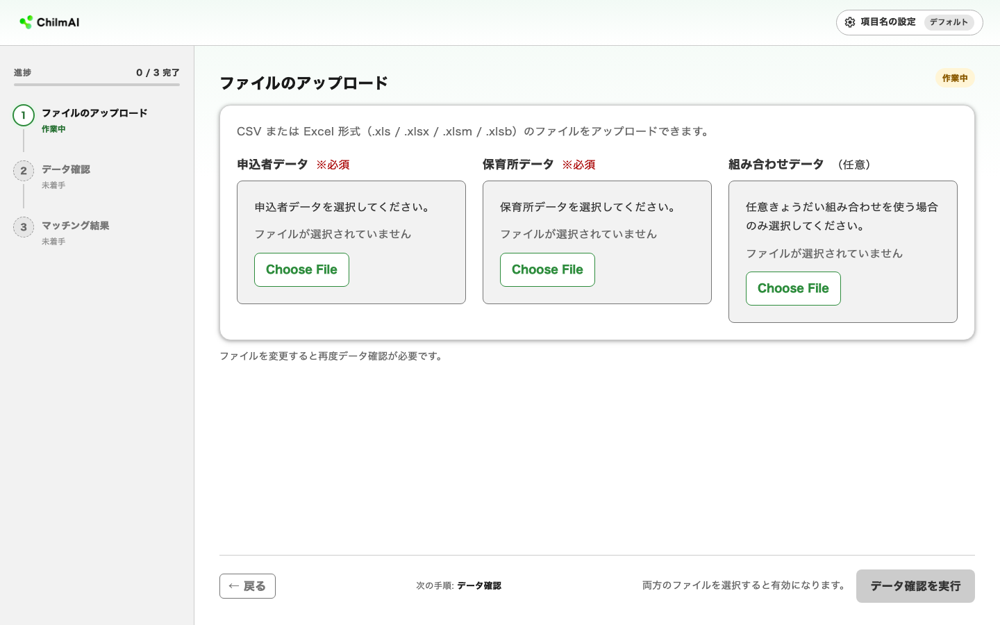
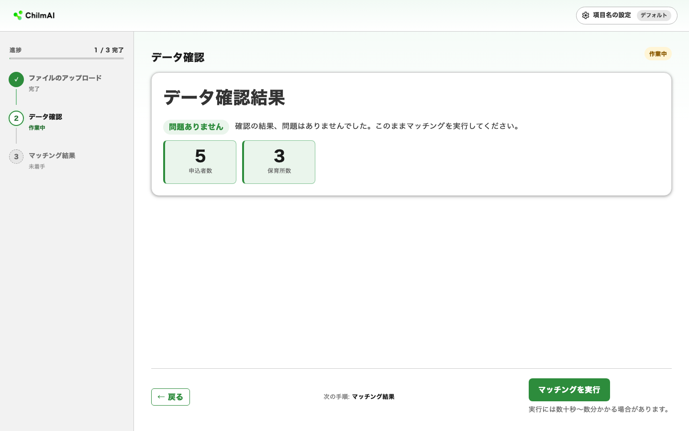

# クイックスタート

このページだけで、**ダウンロード → 起動 → デモデータで選考を実行 → 結果の確認** までを一気に進められます。所要時間の目安は約 30 分です。

まずはこのクイックスタートで、同梱のデモデータを使って ChilmAI のマッチングがどんなものかを体験してください。ひととおり試して「自分のデータでもやってみたい」と思ったら、[自分のデータで使う](prepare-data.md) に進みます。

!!! tip "先にデモで試しておくと"
    - お使いの PC で ChilmAI が正しく動くことを確認できます
    - 実データで問題が起きたとき、「データの問題」か「環境の問題」かを切り分けやすくなります
    - 結果の見方（点数順の優先・転園・きょうだい同時入所）がわかります

各ステップの詳しい説明やトラブル対処は、折りたたみ（▶）を開くと確認できます。

## 動作環境を確認する {#requirements}

| 項目 | 推奨 | 備考 |
|---|---|---|
| OS | Windows 11（64-bit） | |
| メモリ | 8 GB 以上 | 数千件規模のデータでは 16 GB 推奨 |
| 空きディスク | 2 GB 以上 | |
| ブラウザ | Microsoft Edge / Google Chrome 最新版 | |
| インターネット接続 | **不要（初回のダウンロード時を除く）** | ダウンロード後はお使いの PC の中だけで動作します |

このほか、ChilmAI は PC 内部の通信で「通信窓口（ポート）」として 8501 番を使います。このため **同じ PC で ChilmAI を 2 つ同時に起動することはできません**。2 人以上で作業する場合は、それぞれの PC で起動してください。

## ダウンロードと展開

**ZIP ファイルを展開してできたフォルダを任意の場所に置くだけ** で準備が完了し、管理者権限も不要です。

1. ブラウザで配布ページ（[GitHub Releases](https://github.com/CyberAgent/ChilmAI/releases)）を開きます
2. **Assets**（添付ファイル）の一覧から `ChilmAI-vX.Y.Z.zip` をクリックしてダウンロードします
3. ダウンロードした ZIP ファイルを展開します。Windows では次の手順で展開できます。
    1. エクスプローラーで、ダウンロードした `ChilmAI-vX.Y.Z.zip` を右クリックし、**「すべて展開」** を選択します
    2. 展開先フォルダを確認します。既定では ZIP と同じ場所に `ChilmAI-vX.Y.Z` フォルダが作られます（展開先は任意のフォルダに変更できます。例：`C:\Users\<ユーザー名>\Documents\`）
    3. **「展開」** をクリックします。展開先フォルダの中に、`ChilmAI.exe` を含む `ChilmAI` フォルダが作成されます

!!! warning "ダウンロード元を確認してください"
    必ず公式リポジトリ（CyberAgent/ChilmAI）の Releases ページから取得してください。メール添付や社外サーバなど、不審な配布元からは取得しないでください。

展開先のフォルダには書き込み権限が必要です（設定ファイルなどを書き出すため）。ネットワーク共有フォルダではなく、PC のローカルディスクに置くことを推奨します。

??? note "展開中に国名・地名のようなファイル名が表示されたら"
    展開中に「エジプト」「日本」など国名・地名のようなファイル名が表示されることがありますが、これは世界の時刻情報（タイムゾーンデータ）のファイルで、正常な内容です。不審なファイルではありませんので、そのまま展開を続けてください。

## 起動する

`ChilmAI.exe` を **ダブルクリック** します。起動すると次の順で画面が開きます。

1. 黒い背景のウィンドウ（コマンドプロンプト）が開きます — **これが ChilmAI の本体です**
2. 数秒後、ブラウザが自動で開き、ChilmAI の画面が表示されます

!!! warning "黒いウィンドウは閉じないでください"
    黒いウィンドウを閉じると ChilmAI 本体が終了し、ブラウザの画面も使えなくなります。作業中は開いたままにしてください。

ブラウザが自動で開かない場合は、手動でブラウザを開き、アドレス欄に次を入力してください。

```
http://127.0.0.1:8501
```

??? warning "起動時に Windows の警告が表示されたら"
    初めて `ChilmAI.exe` を起動すると、Windows から確認画面が表示されることがあります。ただし環境によっては表示されないこともあり、表示されなくても異常ではありません。表示された場合は、それぞれ次の手順で進めてください。いずれも初回のみで、2 回目以降は表示されません。

    **「Windows によって PC が保護されました」（SmartScreen）が表示された場合**

    `ChilmAI.exe` にはコード署名（発行元を証明する仕組み）が付いていないため、Windows が発行元を確認できないソフトとして念のため警告を表示します。

    1. 警告画面の **「詳細情報」** をクリックします
    2. 表示される **「実行」** ボタンをクリックします

    **ファイアウォールの許可ダイアログが表示された場合**

    ChilmAI は「PC の中だけで動く通信のしくみ」を使ってブラウザから操作できるようにしているため、Windows のファイアウォールが確認を求めることがあります。この通信は同じ PC の中に閉じており、庁内ネットワークやインターネットには出ません。

    1. **「プライベートネットワーク」** にチェックが入っていることを確認します
    2. **「アクセスを許可する」** をクリックします

    庁内のセキュリティポリシーで未確認ソフトウェアの実行が制限されている場合は、先に情報システム担当に確認してください。

??? note "画面の見かた"
    トップ画面は大きく 3 つの領域に分かれます。

    

    | 領域 | 内容 |
    |---|---|
    | ① ヘッダー | ロゴ（トップに戻る）と「項目名の設定」へのリンク。リンクの右には現在使用中の設定名が表示されます |
    | ② サイドバー | 「1. ファイルのアップロード → 2. データ確認 → 3. マッチング結果」の 3 ステップと進捗が表示されます。完了したステップはクリックで戻って参照できます |
    | ③ メインパネル | 現在のステップの操作画面が表示されます |

## デモデータで選考を実行する

自分のデータを準備する前に、同梱のデモデータで「アップロード → データ確認 → 選考実行 → 結果ダウンロード」を一巡します。

`ChilmAI.exe` と同じフォルダにある `sample/` フォルダに、デモ用の 2 ファイルが入っています。

| ファイル | 内容 |
|---|---|
| `sample/申込者データ_デモ.csv` | 申請児童のデータ。5 名（うち、きょうだい 1 組・転園希望 1 名） |
| `sample/保育所データ_デモ.csv` | 保育所データ。3 園（3 歳枠のみ・合計 5 枠） |

次の手順で進めます。

1. **設定がデフォルトであることを確認する** — アップロード画面に「項目名はデフォルト設定を使用しています」と表示されていれば問題ありません。表示されていない場合は、ヘッダーの「項目名の設定」を開いて「デフォルトに戻す」を実行してください
2. **デモファイルをアップロードする** — 「申込者データ」に `sample/申込者データ_デモ.csv`、「保育所データ」に `sample/保育所データ_デモ.csv` をアップロードします

    2 つのファイルがアップロード済みになっていれば準備完了です。

    

    !!! note "「データ確認を実行」で何がチェックされるか"
        列名が正しく対応しているか、申請者 ID・保育所 ID に重複や空欄がないか、希望した保育所 ID が保育所データに実在するかなど、選考の計算に必要なデータの整合性を確認します。不正なデータのまま選考を実行すると、結果が壊れたり計算自体が失敗したりするため、選考実行の前に必ずこのチェックを行います。

    確認できたら、**「データ確認を実行」** をクリックします。

3. **データ確認の結果を見る** — 緑色の表示とともに「申込者数 5・保育所数 3」と表示されることを確認します

    

4. **マッチングを実行する** — **「マッチングを実行」** をクリックします。デモデータでは数秒で「マッチング完了　5人中5人（100%）に割り当てました。」と表示されます

    

5. **結果をダウンロードして開く** — **「Excelをダウンロード」** をクリックし、保存されたファイルを Excel で開きます

??? note "デモデータの中身（なぜこの結果になるのか）"
    このデモデータは、ChilmAI の選考でよく起きる 3 つの動き（**点数順の優先**・**転園**・**きょうだい同時入所**）をひととおり確認できるように作られています。各列の業務上の意味を押さえておくと、後述の [結果を確認する](#expected-result) で示す結果がなぜそうなるのか追いやすくなります。

    **保育所（`保育所データ_デモ.csv`）**

    | 保育所ID | 保育所名 | 3歳募集人数 |
    |---|---|---|
    | 10 | さくら保育園 | 1 |
    | 20 | ひまわり保育園 | 1 |
    | 30 | つばき保育園 | 3 |

    `3歳募集人数` は、3 歳児クラスの空き枠数です。さくら保育園とひまわり保育園はそれぞれ 1 枠しかないため、同じ保育所を複数人が希望した場合は点数の高い申請者が優先されます。このデモでは、ひまわり保育園を希望する 103（70 点）が 104・105（各 60 点）より優先されて 1 枠を確保するため、104・105 が同時入所できる 2 人分の枠は残りません。

    **申請児童（`申込者データ_デモ.csv`）**

    | 申請者番号 | 世帯番号 | 年齢 | 点数 | 希望1 | 希望2 | 在籍 | きょうだい |
    |---|---|---|---|---|---|---|---|
    | 101 | 1001 | 3 | 100 | 10 | 20 | — | — |
    | 102 | 1002 | 3 | 80 | 10 | 30 | 20 | — |
    | 103 | 1003 | 3 | 70 | 20 | 30 | — | — |
    | 104 | 1004 | 3 | 60 | 20 | 30 | — | 1（同保同時） |
    | 105 | 1004 | 3 | 60 | 20 | 30 | — | 1（同保同時） |

    各列の業務上の意味は次のとおりです。

    | 列 | 業務上の意味 |
    |---|---|
    | 申請者番号 | 申請児童ごとの ID |
    | 世帯番号 | 世帯を識別する ID。**同じ世帯番号の行はきょうだいとして扱われます**（104・105 が該当） |
    | 年齢 | 基準日時点の児童の年齢。入所を希望するクラス（このデモでは 3 歳児クラス）の判定に使います |
    | 点数 | 入所選考の優先度を表す値（自治体によっては「利用調整指数」とも呼ばれます）。**数字が大きいほど優先** されます |
    | 希望1・希望2 | 保育所の希望順位。「希望1」が第 1 希望、「希望2」が第 2 希望です |
    | 在籍 | すでに保育所に在園していて転園を希望している場合に、その在園中の保育所 ID が入ります（在園していなければ `—`） |
    | きょうだい | きょうだい申請の入所パターン番号。「1（同保同時）」は「きょうだい全員が同じ保育所に同じ月から入所すること」を希望する意味です（きょうだいのいない申請者は `—`） |

    この表から、次のことが読み取れます。

    - **点数順の優先**：点数は 101（100 点）が最も高く、104・105（各 60 点）が同点で最も低くなっています
    - **転園**：申請者 102 は保育所 20（ひまわり保育園）に在園中で、保育所 10 か 30 への転園を希望しています
    - **きょうだい同時入所**：104・105 は同じ世帯番号（1004）のきょうだいで、同じ保育所への同時入所（同保同時）を希望しています

## 結果を確認する {#expected-result}

結果ファイルの末尾 2 列（入所選考結果）が次のとおりになっていれば、正常に動作しています。

| 申請者番号 | 結果の保育所 | 解説 |
|---|---|---|
| 101 | 10（さくら保育園） | 最高点。第 1 希望に割当 |
| 102 | 30（つばき保育園） | 在園中のひまわり保育園から第 2 希望へ転園成立 |
| 103 | 20（ひまわり保育園） | 102 の転園で空いた枠に第 1 希望で入所 |
| 104 | 30（つばき保育園） | きょうだい同時入所。第 1 希望のひまわり保育園は満員のため、2 人一緒に入れるつばき保育園へ |
| 105 | 30（つばき保育園） | 同上 |

このデモで、ChilmAI の主要な動きを確認できます。

- 点数の高い申請者から順に、希望順位の高い保育所へ割り当てられる
- 第 1 希望が満員のときは第 2 希望に進む
- 転園が成立すると、転園元の空き枠が他の申請者に使われる
- きょうだい（同保同時）は同じ保育所にそろって入所する

??? note "結果が期待と異なるとき"
    | 症状 | 確認ポイント |
    |---|---|
    | 「列が見つかりません」エラーが出る | 「項目名の設定」がデフォルトになっているか確認し、「デフォルトに戻す」を実行する |
    | 割当先が上の表と一致しない | デモ CSV が書き換わっていないか確認する（メモ帳などで開いて内容を照合） |
    | 「マッチングが実行不可能（INFEASIBLE）」と出る | デモ CSV のきょうだい条件や募集人数が書き換わっていないか確認し、元のファイルに戻す |

    その他の症状は [困ったとき](troubleshooting.md) を参照してください。

## 終了する {#exit}

黒いウィンドウ（コマンドプロンプト）を閉じると ChilmAI が終了します。ブラウザのタブも閉じて構いません。

??? note "IT 担当者向け補足"
    - `ChilmAI.exe` は `127.0.0.1:8501`（ループバック / TCP 8501）にバインドするローカル HTTP サーバとして動作します。ループバック通信は物理 NIC を経由せず、外部ネットワークからこのポートへ直接アクセスされることはありません
    - 同じ PC 上で別プロセスが TCP 8501 をリッスンしていると起動に失敗します
    - 認証機能はないため、同一端末上の他プロセスからはアクセス可能です。共用 PC では Windows ユーザーを分けて利用してください
    - 実行ファイルはコード署名されていません。組織のポリシーで未署名実行ファイルが禁止されている場合は、ハッシュ照合や実行許可リストなどの配備手順を別途整えてください
    - `ChilmAI.exe` は PyInstaller の onedir ビルドです。展開した `ChilmAI` フォルダの中に実行に必要なファイル一式がそのまま配置されており、起動時に Windows の一時フォルダへの展開は行われません。フォルダ内の他ファイルを削除・移動すると起動できなくなるため、フォルダごと移動・削除してください

## 次のステップ

デモで動作を確認できたら、自分の帳票を ChilmAI で使えるように準備します → [自分のデータで使う](prepare-data.md)
