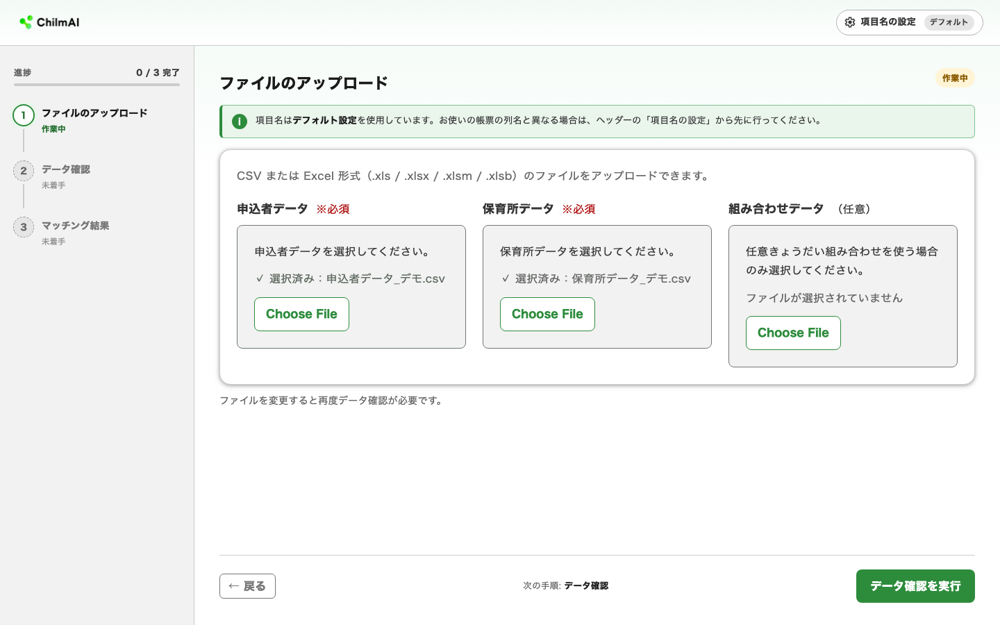
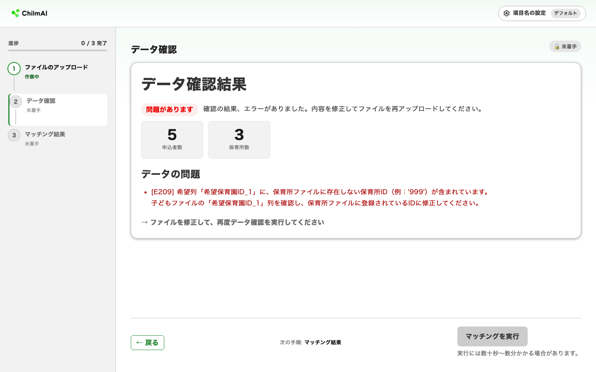
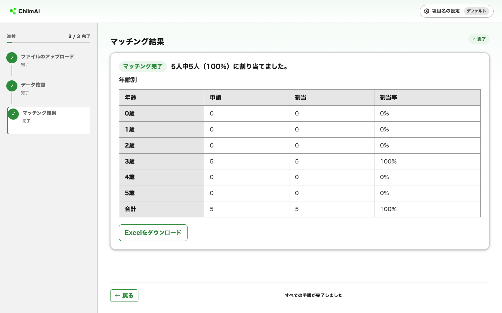

# 選考の実行と結果の見方

このページでは、整形済みのデータをアップロードして入所選考を実行し、結果を確認するまでを説明します。

画面のサイドバーに表示される 3 ステップ（ファイルのアップロード → データ確認 → マッチング結果）をそのまま進めます。

## ステップ 1：ファイルをアップロードする {#upload}

トップ画面で、次のファイルを選択します（クリックして選択、またはドラッグ＆ドロップ）。

| ファイル | 必須／任意 | 形式 |
|---|---|---|
| 申込者データ | 必須 | CSV / .xlsx / .xls / .xlsm / .xlsb |
| 保育所データ | 必須 | 同上 |
| 組み合わせデータ | 任意（[組み合わせファイル](prepare-data.md#siblings) を使う自治体のみ） | 同上 |

!!! note "ファイル選択ボタンの表示は英語になる場合があります"
    ファイルを選ぶボタンはブラウザ標準の機能を使っているため、ブラウザの表示言語設定によっては「Choose File」など英語で表示されることがあります（掲載しているスクリーンショットも英語表示です）。動作に違いはありません。

!!! warning "Excel ファイルは先頭シートだけが読み込まれます"
    2 枚目以降のシートは警告なく無視されます。データは必ず先頭シートに置き、ヘッダー行を 1 行目にしてください。

!!! warning "CSV を使う場合は「CSV UTF-8」形式で保存してください"
    Excel の「名前を付けて保存」で既定の **「CSV (コンマ区切り) (\*.csv)」** を選ぶと、文字コード（文字を保存する方式）が Shift-JIS になり、ChilmAI では読み込めません。この形式のファイルをアップロードすると、「ファイルの文字コードが UTF-8 ではないため読み込めませんでした」（エラーコード E405）と表示されて失敗します。保存形式の一覧から **「CSV UTF-8 (コンマ区切り) (\*.csv)」** を選んで保存し直してください。文字コードを気にしたくない場合は、CSV ではなく Excel 形式（.xlsx）のままアップロードすれば問題ありません。

両方のファイルを選択すると **「データ確認を実行」** ボタンが押せるようになります。

## ステップ 2：データ確認 {#validate}

**「データ確認を実行」** をクリックすると、ファイルの整合性チェックが行われます。主に次の項目を確認します。

- 列名が「項目名の設定」と一致しているか
- 申請者 ID・保育所 ID に重複や空欄がないか
- 年齢や点数・募集人数が正しい数値か
- 希望した保育所 ID や在籍保育所 ID が保育所データに実在するか
- きょうだい条件が世帯内で矛盾していないか

不正なデータのまま選考を実行すると、結果が壊れたり計算自体が失敗したりするため、選考実行の前に必ずこのチェックを行います。

**問題がない場合**、緑色の表示とともに申込者数・保育所数が表示されます。人数が手元の帳票の件数と一致することを確認してから先へ進んでください。

**エラーがある場合**、赤色の表示とともにエラーの一覧が表示されます。エラーは 3 種類に分かれます。

| 区分 | 意味 | 対処の入り口 |
|---|---|---|
| ファイル形式の問題 | CSV / Excel 以外のファイル、または破損したファイル | ファイルを選択し直す |
| 設定の問題 | 帳票の列名が「項目名の設定」と一致していない | [項目名の設定](prepare-data.md#column-mapping) を確認する |
| データの問題 | 値の不整合（ID の重複、存在しない保育所 ID など） | メッセージに従ってファイルを修正し、再アップロードする |

エラーメッセージには `E101` のようなコードが付いています。個別の対処は [困ったとき](troubleshooting.md) のエラーコード一覧を参照してください。

## ステップ 3：マッチングを実行する {#run}

データ確認を通過したら **「マッチングを実行」** をクリックします。

ChilmAI は数理最適化（コンピュータで最適な組み合わせを計算する技術）を使い、点数による優先順位を守りながら、マッチング成立人数が最大になる割り当てを計算します。きょうだい条件や転園も考慮されます（転園を希望した児童は、転園先が決まらなかった場合、いま通っている保育所に必ず残れるように計算されます）。

!!! warning "実行中はブラウザを再読み込みしないでください"
    データの規模やきょうだい世帯の数によって、実行には数十秒〜数分かかることがあります。処理中はブラウザや黒いウィンドウを閉じないでください。ブラウザのタブを再読み込み（F5）すると、処理の結果は再表示されず、最初のファイルアップロード画面に戻ってしまいます。表示が固まったように見えても、そのまま完了まで待ってください。長時間（数十分以上）経っても終わらない場合は、[困ったとき](troubleshooting.md) を参照し、必要であれば ChilmAI を再起動してマッチングをやり直してください。

## 結果を確認する {#results}

### 画面のサマリ

処理が完了すると「**マッチング完了　N人中M人（X%）に割り当てました。**」と表示されます。

- **N**：申請児童の総数
- **M**：保育所に割り当てられた児童数
- 転園希望者が転園できず転園元に戻った場合は「（別途 K人が転園元保育所に戻りました）」と表示されます。この K 人は M に含まれません

サマリの下には年齢別の内訳（申請数・割当数・割当率）が表示されます。割当がなかった児童がいる場合、募集人数の不足やきょうだい条件により入所が決まらなかったことを意味します。

### 結果の Excel ファイル

**「Excelをダウンロード」** をクリックすると `matching_result.xlsx` が保存されます。内容は、**入力した申込者データの全列をそのまま引き継ぎ**、末尾に 2 列が追加された形です。

| 追加される列 | 内容 |
|---|---|
| 入所選考結果保育所ID | 割り当てられた保育所の ID。割当なしの場合は空欄 |
| 入所選考結果保育所名 | 同じ保育所の名称。割当なしの場合は空欄 |

??? note "転園が成立しなかった児童の表示"
    転園希望者が転園できなかった場合、結果には転園元の保育所（＝現在の在籍先）が入ります。「項目名の設定」→「出力設定」の **「転園元保育所への割当を結果に含めない」** にチェックを入れると、この場合の結果列が空欄になり、「転園が成立していない児童」を Excel 上で見分けやすくなります。この設定は Excel の表示だけに影響し、画面のサマリ数値（M や X%）は変わりません。

### 業務で使う前の確認ポイント

ChilmAI は結果を返す際、「募集人数（転園で空く枠を含めた受入可能人数）を超えていないか」「転園希望者が行き場を失っていないか」「より高い希望に入れたはずの児童がいないか」を自動で検証しており、結果画面に到達した時点でこれらは満たされています。そのうえで、業務利用の前に次を確認することをおすすめします。

1. **行数**：結果ファイルの行数（ヘッダーを除く）が申請児童数と一致するか
2. **割当先が希望内か**：割り当てられた保育所 ID が、その児童の希望列（または在籍保育所 ID）のいずれかに含まれているか。希望外の施設が入っている場合は列名の対応づけのミスが疑われます
3. **年齢別の割当率**：特定の年齢だけ極端に低い場合は、その年齢の募集人数と申請数のバランスを確認
4. **割当なしの児童**：希望施設への申請の集中や点数を確認し、割当がつかなかった理由を説明できるか

結果ファイルは、自治体の文書保管ポリシーに従って保管してください。ChilmAI 自体は結果を画面表示のために一時的に保持するだけで、終了すると破棄されます。

Excel ファイルの保存を確認したら、黒いウィンドウとブラウザのタブを閉じて ChilmAI を終了して構いません（[終了する](quickstart.md#exit)）。

うまくいかないときは [困ったとき](troubleshooting.md) を参照してください。
